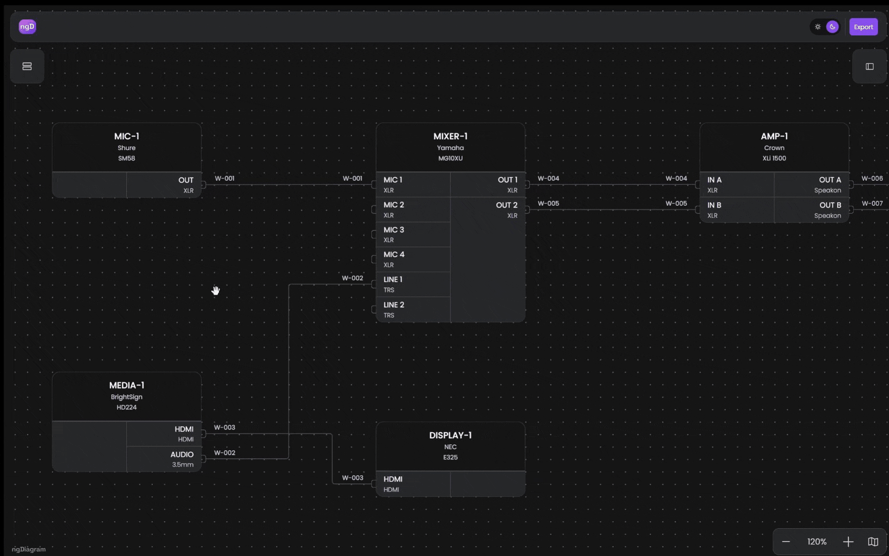

# ngDiagram AV Schematic Template

[](https://opensource.org/licenses/MIT)

**Live demo:** [ngdiagram.dev/templates/av](https://www.ngdiagram.dev/templates/av/)



Interactive AV (audio/video) schematic diagram built with Angular 21 and [ngDiagram](https://www.ngdiagram.dev/). Use this project as a starting point for AV system design — building your own schematic, signal-flow, or device-wiring diagram. Lean dependencies: Angular, ngDiagram, and [html-to-image](https://www.npmjs.com/package/html-to-image) (for PNG export) — no opinionated third-party UI libraries.

Features:

- **Device nodes** — header (device ID, manufacturer, model) with input ports on the left and output ports on the right; each port shows its connector type (XLR, HDMI, Speakon, …)
- **Wires** — orthogonal edges with the wire ID labelled near both ends, plus selection and connected-wire highlight states
- **Manual wire routing** — drag a midpoint handle of a selected wire to slide a segment or pull an L-bend out of it; endpoints follow node moves while interior bends stay put; grid snap follows the node-drag snap setting; **Reset routing** in the sidebar restores ngDiagram's auto route — see [`docs/edge-reshaping.md`](docs/edge-reshaping.md)
- **Relink wires** — drag an endpoint grip of a selected wire onto another port to reconnect it, or into empty space to leave it dangling
- **Dangling wires** — drawing from a port into empty space keeps a one-ended wire stub instead of discarding it
- **Port navigation** — double-click a port to pan to the device on the other end of the wire
- **Properties sidebar** — edit device and wire fields with live updates, including an inline ports editor (add, remove, reorder, flip direction, pick a connector type)
- **Device library** — collapsible palette of device templates (microphones, mixers, amplifiers, loudspeakers, displays, cameras, switchers, …) you drag onto the canvas; search with match highlighting; add, edit, or remove your own templates with a save-or-discard buffer
- **Auto device IDs** — a dropped device gets the next free ID for its category prefix (`MIC-1`, `CAM-1`, `DEV-1` for unmapped categories); the category field is an editable combobox (pick from the list or type your own)
- **Minimap** with zoom controls, and a dark/light theme
- **Export** to PNG (raster, theme-aware) and DXF (vector — opens in AutoCAD, BricsCAD, LibreCAD) from the top navbar — see [`docs/export.md`](docs/export.md)

## Getting Started

Built against Angular 21.2 and ngDiagram 1.3 (see `package.json`); Node.js 20.19+ or 22.12+ and npm 10+.

```bash
git clone https://github.com/synergycodes/ng-diagram-av-schematic.git
cd ng-diagram-av-schematic
npm install
npm start
```

Open [http://localhost:4200](http://localhost:4200) — a sample rig of 7 devices and 7 wires loads. Try dragging a device from the left library onto the canvas, wiring two ports, then selecting a wire and dragging one of its midpoint handles. The rig and the device library are sample data — replace them in [`diagram/data.ts`](src/app/av-schematic/diagram/data.ts) and [`library-sidebar/seed-library.ts`](src/app/av-schematic/library-sidebar/seed-library.ts).

## Scripts

| Command | Description |
|---|---|
| `npm start` | Start dev server with hot reload |
| `npm run build` | Production build to `dist/` |
| `npm test` | Run unit tests via Vitest (`@angular/build:unit-test` builder) |
| `npm run format` | Format with Prettier |
| `npm run format:check` | Check formatting (used by CI) |
| `npm run lint` | Run ESLint; `--max-warnings=0` so any warning fails CI |
| `npm run lint:fix` | Run ESLint with autofix |
| `npm run type-check` | `tsc -b --noEmit` — type-check both app and spec configs via project references |

## Documentation

Deep-dive documentation lives in [`docs/`](docs/):

- [`docs/architecture.md`](docs/architecture.md) — service hierarchy, key patterns, project structure
- [`docs/edge-reshaping.md`](docs/edge-reshaping.md) — manual wire routing, endpoint relinking, and dangling-wire creation: how the three features split, and which parts are meant to move into ngDiagram
- [`docs/export.md`](docs/export.md) — PNG and DXF export pipelines

## ngDiagram APIs Demonstrated

This template wires up a focused subset of the ngDiagram public surface. Useful as a reference for which APIs to reach for in a wiring/schematic integration.

| Concern | API | Where in this repo |
|---|---|---|
| Bootstrap | `provideNgDiagram()` | `pages/av-schematic-page.component.ts` |
| Diagram component | `<ng-diagram>` (`NgDiagramComponent`) | `diagram/diagram.component.html` |
| Background | `<ng-diagram-background>` (`NgDiagramBackgroundComponent`) | `diagram/diagram.component.html` |
| Minimap | `<ng-diagram-minimap>` (`NgDiagramMinimapComponent`) | `minimap-panel/minimap-panel.component.ts` |
| Custom node template | `NgDiagramNodeTemplateMap`, `NgDiagramNodeTemplate<TData>` interface | `diagram/diagram.component.ts`, `diagram/node/device-node.component.ts` |
| Custom edge template | `NgDiagramEdgeTemplateMap`, `NgDiagramEdgeTemplate<TData>`, `NgDiagramBaseEdgeComponent` | `diagram/wire-edge.component.ts` |
| Edge labels | `NgDiagramBaseEdgeLabelComponent`, `EdgeLabelPosition` (absolute `'30px'` and `'-30px'`) | `diagram/wire-edge.component.html` |
| Connection ports | `<ng-diagram-port>` (`NgDiagramPortComponent`) | `diagram/node/device-node.component.html` |
| Palette items | `<ng-diagram-palette-item>` (`NgDiagramPaletteItemComponent`), `<ng-diagram-palette-item-preview>` (`NgDiagramPaletteItemPreviewComponent`), `NgDiagramPaletteItem` (defaults to `BasePaletteItemData` which requires a `label` — `asDevicePaletteItem()` localizes the cast since our device nodes have no label) | `library-sidebar/components/library-list-item/*` |
| Palette drop | `paletteItemDropped` output, `PaletteItemDroppedEvent` (used to auto-fill missing `deviceId`) | `diagram/diagram.component.ts` |
| Edge routing | `NgDiagramConfig.edgeRouting` (`orthogonal` with `firstLastSegmentLength`, `maxCornerRadius`) | `diagram/diagram.component.ts` |
| Manual edge points | `Edge.points`, `Edge.routingMode: 'manual'` | `diagram/edge-reshaping/*` |
| Node-move reflow of manual edges | `selectionMoved` / `nodeDragEnded` outputs (`SelectionMovedEvent`, `NodeDragEndedEvent`) | `diagram/diagram.component.html`, `diagram/edge-reshaping/middleware/edge-stretch-on-move.ts` |
| Dangling wires | `edgeDrawEnded` output (`EdgeDrawEndedEvent`) — a port-to-nowhere draw becomes a one-ended manual edge | `diagram/dangling-edge-creation/dangling-edge.service.ts` |
| Port-side metadata | `Node.measuredPorts[].side`, `Edge.sourcePort` / `targetPort` — since ngDiagram 1.3 the `side` is refreshed when a port is recreated with a different side (e.g. direction flip), so the app trusts it directly | `diagram/edge-reshaping/logic/port-orientation.ts`, `diagram/edge-reshaping/logic/port-position.ts` |
| Snap config | `NgDiagramConfig.snapping` (`shouldSnapDragForNode`, `defaultDragSnap`, `computeSnapForNodeDrag`) | `diagram/edge-reshaping/commands/reshape-edge.ts` |
| Linking | `NgDiagramConfig.linking.finalEdgeDataBuilder` (assigns wire type and generates a wireId) | `diagram/diagram.component.ts` |
| Model init | `initializeModel()` | `diagram/diagram.component.ts` |
| Model reads | `NgDiagramModelService` (`getNodeById`, `getEdgeById`, `getConnectedEdges`) | `properties-sidebar/element-mutation.service.ts`, `properties-sidebar/properties-sidebar.service.ts`, `diagram/port-focus.service.ts` |
| Model writes | `NgDiagramModelService` (`deleteNodes`, `deleteEdges`) | `properties-sidebar/element-mutation.service.ts` |
| Live data edits | `NgDiagramModelService` (`updateNodeData`, `updateEdgeData`) | `properties-sidebar/element-mutation.service.ts` |
| Atomic transactions | `NgDiagramService.transaction(..., { waitForMeasurements: true })` | `properties-sidebar/element-mutation.service.ts` |
| Measurement invalidation | `NgDiagramService.invalidateMeasurements({ nodes })` — awaitable since ngDiagram 1.3, resolves once re-measurement lands in the model | `properties-sidebar/element-mutation.service.ts` |
| Template-output event payloads | `DiagramInitEvent`, `SelectionGestureEndedEvent` | `diagram/diagram.component.ts` |
| Viewport state | `NgDiagramViewportService` (`scale()`, `viewport()`, `canZoomIn`, `canZoomOut`) | `minimap-panel/minimap-panel.component.ts` |
| Viewport actions | `NgDiagramViewportService` (`zoomToFit`, `zoom`, `moveViewport`) | `diagram/diagram.component.ts`, `diagram/viewport-animation.service.ts`, `minimap-panel/minimap-panel.component.ts` |
| Selection | `NgDiagramSelectionService` (`selection()`) | `properties-sidebar/properties-sidebar.service.ts`, `diagram/node/device-node.component.ts` |
| Config typing | `NgDiagramConfig` | `diagram/diagram.component.ts` |
| Core types | `Node<TData>`, `Edge<TData>` | throughout |

## Customizing for Your Project

### Configuration

Tunable values (viewport zoom step, padding, etc.) are centralized in a single config file:

**`src/app/av-schematic/av-schematic.config.ts`**

To override defaults, add `provideAvSchematicConfig` to your page providers:

```typescript
import { provideAvSchematicConfig } from './av-schematic.config';

providers: [
  provideAvSchematicConfig({
    viewport: { zoomToFitPadding: 40, zoomStep: 0.2 },
    snapping: { gridSize: 40 },          // or { enabled: false } to turn snap off
  }),
]
```

`snapping.enabled` (default `true`) toggles grid snap for both node drag and manual edge bends — the bend snap rides on the same opt-in, see [`docs/edge-reshaping.md`](docs/edge-reshaping.md). `gridSize` (default `20`) sets the step in diagram units. Unspecified values keep their defaults. See `AvSchematicConfig` interface for all options.

### Data Model

Node and edge data interfaces are defined in `src/app/av-schematic/diagram/model/interfaces.ts`.

`DeviceNodeData`:

| Property | Purpose |
|---|---|
| `type: 'device'` | Discriminator |
| `deviceId` | Bold header line (e.g. `AMP-01`) |
| `manufacturer` | Header subtitle |
| `model` | Header subtitle |
| `category` | Free-text metadata (editable in sidebar) |
| `location` | Free-text metadata (editable in sidebar) |
| `ports` | Array of `DevicePort` |

`DevicePort`:

| Property | Purpose |
|---|---|
| `id` | Port id (referenced by edges via `sourcePort`/`targetPort`) |
| `label` | Visible port label (e.g. `OUT A`) |
| `direction` | `'input'` (left column) or `'output'` (right column) |
| `connectorType` | Optional subtitle (e.g. `XLR`, `HDMI`, `Speakon`) |

`WireEdgeData`:

| Property | Purpose |
|---|---|
| `type: 'wire'` | Discriminator |
| `wireId` | Rendered as label near both ends of the edge (editable in sidebar) |
| `wireType` | Optional signal kind: `audio`, `video`, `speaker`, `ethernet`, `power`, `control`, `usb`, `fiber` (editable in sidebar) |

### Node Component

[`diagram/node/device-node.component.*`](src/app/av-schematic/diagram/node/) renders every device: a header with the device ID, manufacturer, and model, then an input-port column on the left and an output-port column on the right.

- **Header fields** — the template reads `deviceId`, `manufacturer`, and `model` from the node data. To show another field, add it to `DeviceNodeData` (see Data Model), to the device form, and to this template.
- **Node and port size** — `--av-node-width`, `--av-port-width`, `--av-port-height` in [`src/tokens.css`](src/tokens.css) (see Theming). The port shape itself is `.port-shape` in the component SCSS.
- **State styling** — the host element gets the classes `selected`, `edge-highlighted`, `is-link-target`, and `is-linking`; style them in the component SCSS.
- **A second node type** — add a value to `NodeTemplateType` in [`diagram/model/interfaces.ts`](src/app/av-schematic/diagram/model/interfaces.ts), write a component implementing `NgDiagramNodeTemplate<YourData>`, and register it in `nodeTemplateMap` in [`diagram/diagram.component.ts`](src/app/av-schematic/diagram/diagram.component.ts).

### Edge Component

[`diagram/wire-edge.component.*`](src/app/av-schematic/diagram/) renders every wire on top of ngDiagram's `<ng-diagram-base-edge>`, so the path itself comes from the library.

- **Stroke** — `strokeColor()` and `strokeWidth()` in the component: `--av-color-wire-stroke` normally, `--av-color-accent` when selected. To color wires by `wireType`, branch there.
- **Labels** — two `<ng-diagram-base-edge-label>` elements show the `wireId` at `30px` from the source and `-30px` from the target. Change `positionOnEdge` or the label content in the HTML.
- **Routing** — `edgeRouting` in [`diagram/diagram.component.ts`](src/app/av-schematic/diagram/diagram.component.ts): `orthogonal`, `firstLastSegmentLength: 80`, `maxCornerRadius: 4`. Manual reshaping is a separate feature — see [`docs/edge-reshaping.md`](docs/edge-reshaping.md).
- **A second edge type** — same recipe as for nodes: `EdgeTemplateType`, a component implementing `NgDiagramEdgeTemplate<YourData>`, and `edgeTemplateMap`.

### Adding Your Own Data

Replace the seed data in `src/app/av-schematic/diagram/data.ts`. Each device node needs:

- A unique `id`
- `type: 'deviceNode'` (use the `NodeTemplateType.DeviceNode` enum)
- An explicit `position: { x, y }` (no automatic layout — see [`docs/edge-reshaping.md`](docs/edge-reshaping.md))
- A `data` object matching `DeviceNodeData`

Each wire edge needs:

- A unique `id`
- `type: 'wireEdge'` (use the `EdgeTemplateType.WireEdge` enum)
- `source` / `target` device ids and `sourcePort` / `targetPort` port ids
- A `data` object matching `WireEdgeData`

### Device Library (drag-and-drop palette)

The left panel holds **device templates** — recipes without `id` or `position` that become nodes when dragged onto the canvas. `<ng-diagram>` handles the drop itself; the app only fills in a missing `deviceId`.

- **Bundled templates** — [`library-sidebar/seed-library.ts`](src/app/av-schematic/library-sidebar/seed-library.ts). Each entry is `{ libraryId, template }` with a stable `libraryId`, an empty `deviceId` (generated on drop), and realistic `manufacturer` / `model` / `category` / `ports`. Or add one in the app with **+ Add device** at the bottom of the list.
- **Categories and ID prefixes** — [`diagram/model/device-categories.ts`](src/app/av-schematic/diagram/model/device-categories.ts) maps each category to its prefix (`microphone` → `MIC`, `camera` → `CAM`, …); add an entry and both the category combobox and the ID generator pick it up. Unmapped categories fall back to `DEV-N`. The generator itself is [`diagram/model/auto-device-id.ts`](src/app/av-schematic/diagram/model/auto-device-id.ts): the smallest free number for that prefix.
- **Search** — [`library-sidebar/components/library-search/`](src/app/av-schematic/library-sidebar/components/library-search/): 150 ms debounce, case-insensitive match on manufacturer or model. The filtering lives in `filteredDevices` in [`library-sidebar/library.service.ts`](src/app/av-schematic/library-sidebar/library.service.ts).
- **Row and drag preview** — [`library-sidebar/components/library-list-item/`](src/app/av-schematic/library-sidebar/components/library-list-item/): each row is an `<ng-diagram-palette-item>` with a custom `<ng-diagram-palette-item-preview>` ghost card.
- **Add / edit form** — [`library-sidebar/components/library-detail/`](src/app/av-schematic/library-sidebar/components/library-detail/) reuses the device form from the properties sidebar. Edits go to a draft ([`library-draft.service.ts`](src/app/av-schematic/library-sidebar/library-draft.service.ts)) until **Save**; **Back** discards it. Instance-only fields (`deviceId`, `location`) are hidden through `DEVICE_FORM_HIDDEN_FIELDS`.

### Theming

Theme is driven by the `data-theme` attribute on `<html>` (`"light"` or `"dark"`) and persisted in `localStorage`. The toggle UI lives in `src/app/av-schematic/top-navbar/theme-toggle/theme-toggle.component.ts`.

Color and dimension tokens are defined in `src/tokens.css`:

- **`--ngd-colors-*`** — base palette (grays + accent ramps `acc1`–`acc9`).
- **`--ngd-*` semantic tokens** — UI surfaces, text colors, edge defaults, etc., theme-aware.
- **`--av-*` schematic tokens** — node width, port dimensions, accent and wire stroke aliases:
  - `--av-node-width`, `--av-port-width`, `--av-port-height`
  - `--av-color-accent`, `--av-color-wire-stroke`

Global stylesheet entry point: `src/styles.css` (imports `tokens.css`, typography, and `ng-diagram/styles.css`).

## Tech Stack

- **Angular 21** — standalone components, signals, OnPush change detection, zoneless (`provideZonelessChangeDetection()`) — no `zone.js`, re-renders driven by signal mutations only
- **`@angular/forms/signals`** — sidebar forms (signal-backed `form()`, per-field `debounce()`)
- **ngDiagram** ([`ng-diagram`](https://www.npmjs.com/package/ng-diagram) on npm) — diagram rendering, viewport management, selection, edge routing
- **html-to-image** — PNG capture (DXF has no library dependency, written as ASCII directly)
- **ESLint** (flat config) with `angular-eslint` + typescript-eslint `strict-type-checked` + `stylistic-type-checked`
- **Prettier** — code formatting
- **Vitest** — unit test runner via `@angular/build:unit-test`

## ngDiagram Documentation

For comprehensive ngDiagram documentation, examples, and API reference, visit: **[ngdiagram.dev/docs](https://www.ngdiagram.dev/docs)**

## Support

- **Issues**: [GitHub Issues](https://github.com/synergycodes/ng-diagram-av-schematic/issues)
- **ngDiagram Discussions**: [GitHub Discussions](https://github.com/synergycodes/ng-diagram/discussions), [Discord](https://discord.gg/FDMjRuarFb)
- **ngDiagram Documentation**: [ngdiagram.dev/docs](https://www.ngdiagram.dev/docs)

## License

MIT — see [LICENSE](LICENSE).

---

Built with ❤️ by the [Synergy Codes](https://www.synergycodes.com/) team
